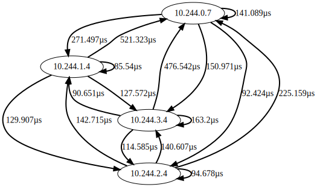

# adjacency

Adjacency creates an adjacency matrix for an SRV record to check the latencies between nodes in a network.

It can generate a square (n x n) matrix from all (n) nodes where the service is running.
Alternatively, if an SRV record for a different service that runs on m nodes is specified at query-time, it will produce a n x m matrix of latencies from nodes to service endpoints. 


[](https://goreportcard.com/report/github.com/kilo-io/adjacency)

## Getting Started

Run the adjacency service and specify an SRV record that resolves to all the endpoints where the service is running:

```shell
docker run --rm -p 3000:3000 kiloio/adjacency --srv _service._tcp.example.com
```

Do this for all nodes.
Keep in mind, that the value of the `--srv` flag _must_ to resolve to the endpoints of all the nodes.

Now, to get the square adjacency matrix, make a GET request to the API, e.g. using cURL:

```shell
curl example.com:3000 
```

To get the n x m matrix for the latencies between all nodes of this service and another service's endpoints, specify an `srv` query parameter in the GET request:

```shell
curl example.com:3000?srv=_anotherservice._tcp.example.com
```

To format the output as JSON, add the `format=json` query parameter to the request, e.g.:

```shell
curl example.com:3000?format=json
```

## Kubernetes

Apply the adjacency service to a Kubernetes cluster with

```shell
kubectl apply -f https://raw.githubusercontent.com/kilo-io/adjacency/main/example.yaml
```

## API

### /

Generate a complete adjacency matrix:

```shell
curl example.com:3000
```

#### srv=\_service.\_tcp.example.com

Use the `srv` query parameter to set the target SRV record to another service.
This will result in an n x m matrix.

#### format

Use the `format` query parameter to format the output
 - format=json JSON
 - format=simple only times in a table
 - format=fancy table with borders, error code and IP addresses or hostnames (hostname is fallback)
 - format=standard error codes with times 
 - format=svg renders an svg image of the graph



### /vector

Generate an adjacency vector from the point of view of a specific node:

```bash
curl example.com:3000/vector?srv=_service._tcp.example.com
```

#### srv=\_service.\_tcp.example.com

Use the `srv` query parameter to set the target SRV record to another service.

### /ping

Check if service is running:

```shell
curl example.com:3000/ping
# The service should respond with pong.
```
